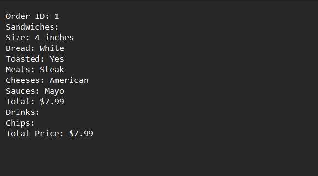

# Dean's Deli

## Description of the Project

This Java application is a simulation of a deli ordering system. It aims to make ordering fast and convenient by allowing customers to order sandwiches, chips, and drinks as well as extra toppings.

## User Stories

- As a user, I want to be able to order more than one sandwich.
- As a user, I want to be able to order chips and drinks.
- As a user, I want to be able to order extra toppings.
- As a user, I want to be able to order different sized meals.

## Setup

Instructions on how to set up and run the project using IntelliJ IDEA.

### Prerequisites

- IntelliJ IDEA: Ensure you have IntelliJ IDEA installed, which you can download from [here](https://www.jetbrains.com/idea/download/).
- Java SDK: Make sure Java SDK is installed and configured in IntelliJ.

### Running the Application in IntelliJ

Follow these steps to get your application running within IntelliJ IDEA:

1. Open IntelliJ IDEA.
2. Select "Open" and navigate to the directory where you cloned or downloaded the project.
3. After the project opens, wait for IntelliJ to index the files and set up the project.
4. Find the main class with the `public static void main(String[] args)` method.
5. Right-click on the file and select 'Run UI.main()' to start the application.

## Technologies Used

- Java: Coretto 17

## Demo

## Future Work

Outline potential future enhancements or functionalities you might consider adding:

- More sauce options
- More side options
- More Topping options
- DoorDash ordering

## Team Members

- **Dean** - Student
- **Zach** - Tutor

## Thanks

Express gratitude towards those who provided help, guidance, or resources:

- Thank you to Ray for continuous support and guidance.
- A special thanks to all teammates for their dedication and teamwork.
 